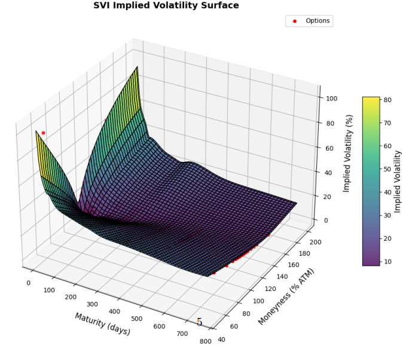

# Structured Products Pricing Engine with Volatility Surfaces

Generic **Python pricing engine** for structured products, options, bonds and swaps, built with a modular architecture and exposed through a **Django web interface**.

Originally developed as an academic project (Université Paris-Dauphine, Master 272 – April 2025), this repository aims to mimic a **professional-grade pricing stack**: market objects, yield curves, volatility surfaces, stochastic processes, discretization-scheme, Monte Carlo engines, and a web UI for interactive pricing. 

> **Disclaimer**: Research / educational code only. Not intended for production use.

> **Example of calibrated volatility surface:**
> <p align="center">
>   
> </p>

---

## ✨ Key features

- **Unified pricing engine** for:
  - Vanilla and exotic **equity options** (European, American, Bermudan, Asian, lookback, barrier, digital, floating-strike, etc.)
  - **Structured products**: Autocalls (Phoenix, Eagle, memory, defensive / “Security” style), Airbag, Twin-Win.
  - **Fixed-income instruments**: bonds (price ↔ yield), vanilla interest-rate swaps.
- **Market & model layer**
  - Market object with **yield curves**, **underlyings**, and **implied volatility surfaces**.
  - Support for **Black–Scholes** and **Heston** dynamics (1-factor / 2-factor processes). 
  - Volatility models: **SVI**, **SSVI**, **Heston** and **local volatility (Dupire)**.
- **Monte Carlo engine**
  - Generic Euler scheme for simulating paths under risk-neutral dynamics.
  - Reusable stochastic processes for vanilla, callable and path-dependent payoffs.   
- **Greeks & risk metrics**
  - Finite-difference Greeks: Delta, Gamma, Vega, Rho, Theta.
  - Confidence intervals via Monte Carlo standard error.
- **Web interface (Django)**
  - Forms to configure products, market parameters and models.
  - Live pricing, Greeks and payoff charts rendered in the browser.  

---

## 🧱 Architecture overview

### **Volatility models**

- **SVI (Stochastic Volatility Inspired)**  
  Total variance as a function of log-moneyness $k$:

  $$
  w(k) = a + b \Big( \rho (k - m) + \sqrt{(k - m)^2 + \sigma^2} \Big)
  $$

  Used to fit a single maturity smile with an explicit parametric form.

- **SSVI (Surface SVI)**  
  Extension to full maturity surface with parameters depending on ATM total variance, ensuring time consistency and (theoretically) absence of static arbitrage. 

- **Local volatility (Dupire)**  
  Local variance obtained from call prices $C(K, T)$:

  $$
  \sigma_{\text{loc}}^2(K, T) =
  \frac{\partial_T C + r K \partial_K C + q C}
       {\tfrac{1}{2} K^2 \partial_{KK} C}
  $$

  Implemented as an experimental module; highly sensitive to interpolation and numerical differentiation.

- **Heston stochastic volatility**

  In the Heston model, both the underlying price $S_t$ and its variance $v_t$ are stochastic. Under the risk-neutral measure:

  $$
  \begin{aligned}
  dS_t &= r S_t \, dt + \sqrt{v_t}\, S_t \, dW_t^S, \\
  dv_t &= \kappa (\theta - v_t) \, dt + \xi \sqrt{v_t} \, dW_t^v, \\
  d\langle W^S, W^v \rangle_t &= \rho \, dt.
  \end{aligned}
  $$

  where $\kappa$ is the mean-reversion speed, $\theta$ the long-term variance, $\xi$ the vol-of-vol and $\rho$ the correlation between the Brownian motions.
  
  In this project, Heston is used as a **stochastic volatility driver** for the Monte Carlo engine: paths for $(S_t, v_t)$ are simulated jointly (Euler scheme with truncation of negative variances), and any payoff compatible with our product abstractions can be priced on top of these paths (vanilla, exotics, structured products).
  
  Calibration of Heston parameters to market implied volatility smiles/surfaces is **not** the primary focus of the project. Instead, it is illustrated separately in a dedicated Jupyter notebook (documentation section), which shows how to fit $(\kappa, \theta, \xi, \rho, v_0)$.

---

### **Stochastic processes & Monte Carlo**

- **One-factor process** (e.g. Black–Scholes):  

  $$
  dS_t = r S_t \, dt + \sigma S_t \, dW_t
  $$

- **Two-factor Heston process**:  

  $$
  \begin{aligned}
  dS_t &= r S_t \, dt + \sqrt{v_t} S_t \, dW_t^S, \\
  dv_t &= \kappa (\theta - v_t) \, dt + \xi \sqrt{v_t} \, dW_t^v, \\
  d\langle W^S, W^v \rangle_t &= \rho \, dt.
  \end{aligned}
  $$

  Simulated via an Euler scheme with truncation of negative variances.

- **Generic Monte Carlo pricing**

  For a discounted payoff $P(S_T)$ under the risk-neutral measure:

  $$
  C_0 = \mathbb{E} \big[ e^{-\int_0^T r(t)\, dt} \, P(S_T) \big]
       \approx \frac{1}{N} \sum_{i=1}^N e^{-rT} P(S_T^{(i)}).
  $$

  The Monte Carlo engine:
  1. Simulates $N$ independent paths using the chosen stochastic process.
  2. Evaluates the product’s `payoff(path)` on each trajectory.
  3. Aggregates results into `PricingResults` (price, standard error, confidence interval, Greeks).
 
### Web interface (Django)

The project includes a Django-based interface that acts as a thin UI layer on top of the pricing engine.

- Built with **Django + HTML/CSS/JavaScript**.
- Pages for:
  - Option pricing (vanilla & exotic), with payoff chart and Greeks table.
  - Structured products: Autocalls (with coupon solver), Airbag, Twin-Win.
  - Bonds: price ↔ yield.
  - Swaps: par rate solver and valuation.
- Results are returned as JSON by the API and rendered in interactive tables and charts.

> **Entry point**: `python manage.py runserver` then open <http://127.0.0.1:8000/>.

---

## 🚀 Getting started

### Prerequisites
- Python 3.x
- pip
- Django (`pip install django`)

### Installation

```bash
git clone https://https://github.com/thibault-charbonnier/structured-products-pricing-engine.git
cd structured-products-pricing-engine
pip install -r requirements.txt
python manage.py runserver
```

Then open your browser at: http://127.0.0.1:8000/

---

## 📚 References

- J. Gatheral – A parsimonious arbitrage-free implied volatility parameterization with application to the valuation of volatility derivatives (SVI).
- J. Gatheral & A. Jacquier – Arbitrage-free SVI volatility surfaces (SSVI).
- B. Dupire – Pricing with a Smile (local volatility).
- S. Heston – A Closed-Form Solution for Options with Stochastic Volatility.

---

## 🧪 Status & limitations

- Codebase was developed as a student project and focuses on clarity and coverage rather than raw performance.
- Local volatility implementation is numerically fragile and should be treated as experimental.
- No production-grade logging, monitoring or error handling.

---

## 👥 Authors

Project developed as part of the Master 272 – Ingénierie Financière at Université Paris-Dauphine by :
- Thibaut Charbonnier
- Baptiste Dufour
- Jules Hellot
- Adrien Lemasne de Chermont
